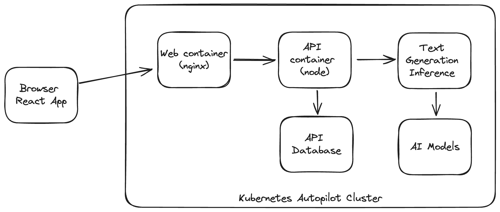

# AI Testing

Example app to test out running AI Models in Kubernetes

## Architecture

There are several components in this application:
* ui - this has the code for the react app, it is deployed in a docker container running nginx
* api - this has the code for the backend API, it is deployed in a container running node
* tgi - this is based on Huggingface Text Generation Inference

## Deploying

You need a cluster with GPU to run these manifests. The manifests can be found in the `k8s` directory.
